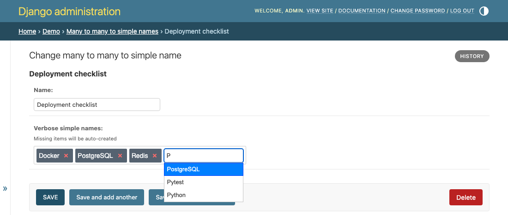

Django Tags Input
=================

Ordered, autocompleting tag inputs for Django ``ManyToManyField``\ s, in your
forms and in the admin.

Django Tags Input replaces the stock multiple-select for ``ManyToManyField``\ s
with a tag box. Type a few letters, pick a match from the autocomplete list,
and the related object is linked. Point it at a model, tell it which field
holds the label, and the form field, the widget, the autocomplete view and the
admin integration are all wired for you.

.. toctree::
   :maxdepth: 2
   :caption: Guides

   getting-started
   playground
   configuration
   admin
   forms
   ordering
   example-project

.. toctree::
   :maxdepth: 1
   :caption: Reference

   tags_input
   changelog
   contributing

.. toctree::
   :maxdepth: 1
   :caption: Project

   sponsor

Indices and tables
------------------

* :ref:`genindex`
* :ref:`modindex`
* :ref:`search`
